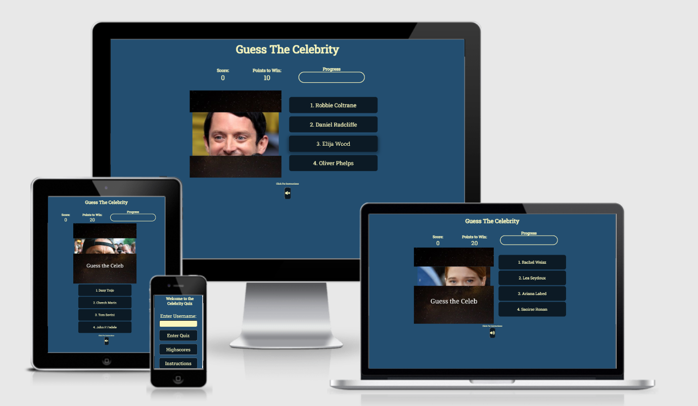
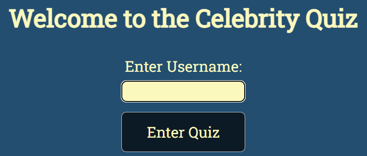
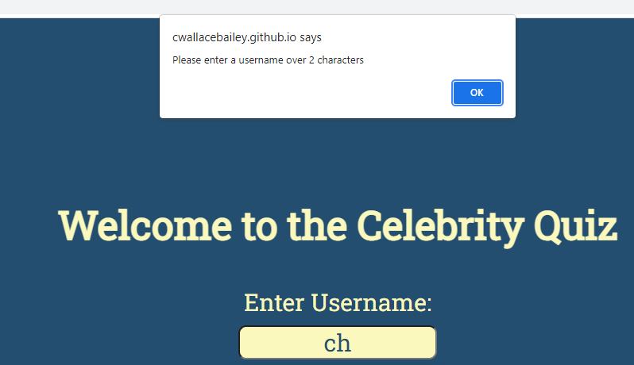
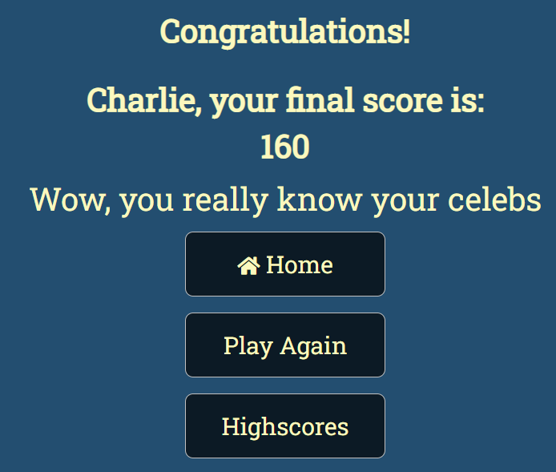
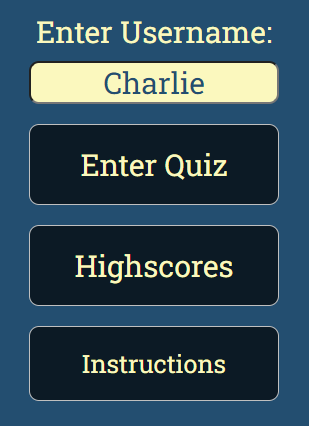
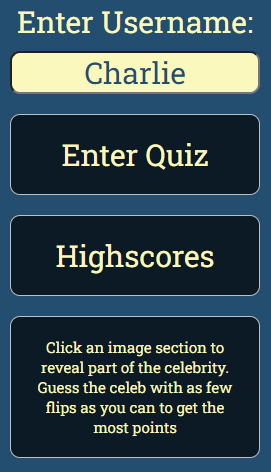
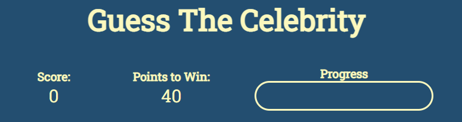
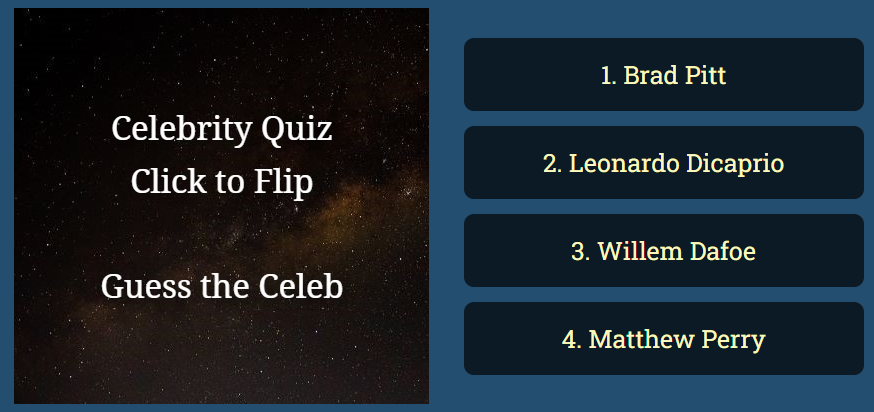
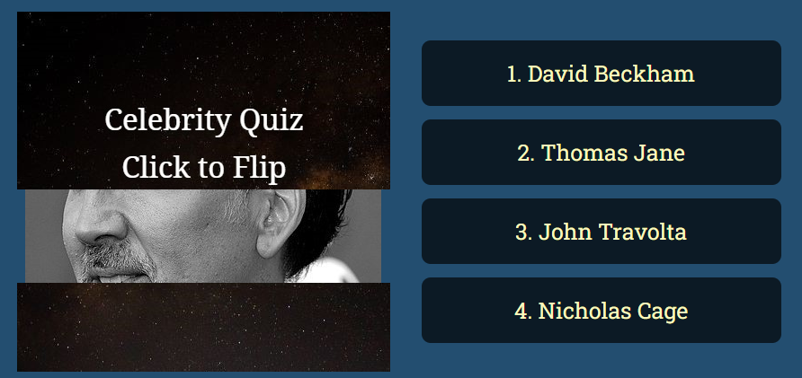

# Celebrity Quiz

The celebrity quiz is designed to be fully interactive, utilsing event listeners to create a image flip function which reveals a portion of a celebrity with each click. Each click then reduces the number of points which can be won in that particular round. the built in object, Math allows random question selection and order and sound effects are used to make the quiz engaging. It is designed to be responsive on multiple devices with a focus on simple, linear navigation. I chose this project mainly as a demonstration of the flexibility and range that Javascript allows. 

Please see the final project [here](https://cwallacebailey.github.io/Project_2_Celebrity_Quiz/).

## Contents

* [User Experience](#user-experience)
    * [Design](#design)
    * [Colours](#colours)
    * [Type Face](#type-face)
* [Features](#features)
    * [Existing Features](#existing-features)

# User Experience

The overall aim for this project was to build an interactive and engaging quiz which could be enjoyed by anyone with no overall target audience other than celebrity fans. This target demographic is wide reaching and diverse and the quiz is designed so that questions can easily be added to expand the quiz. This enables it to remain interesting to both new and return users.  

## Design
---
### Colours

The color scheme is uniform throughout the quiz using hex #234E70 for the blue background with hex #FBF8BE yellow/ cream for the font color. Finally a complimentary navy was chosen for the quiz buttons (hex #0c1a25)

The background colour does not distract from the main features of the quiz and the font colour is easily read as it nicely contrasts with the background. 

### Type Face
Throughout the site Roboto Slab has been used. It's an easy to read, neat font which doesn't distract from the overall appearance of the site.

In case Roboto Slab isn't supported in the browser sans serif is available as a backup. As with Roboto this is an easy to read font which is widely accessible on browsers so should always be available making it an ideal backup font.    

## Features
---
### Existing Features

#### Home Page
---

* Heading and Username
    * The opening page immediately welcomes the user and lets them know the premise of the site, a celebrity quiz. 
    * The site automatically focuses on the username text box preventing the user from having to click into the box. This makes the site easier to use and removes a potentially annoying step for the user. 

* If the user does not enter a username or their username is two characters or less when they click the "enter quiz button an alert will appear asking for a username over two characters
    

* The username is then stored locally to be displayed on the final page of the quiz, congratulating the user on finishing. This adds value as it adds a personal touch to the congratulations at the end of the quiz. A friendly vibe along with a fun quiz will invite further visits.

* Button Hovering
    * When the cursor hovers over a button is increases in size by 3% and gains a slight shadow effect over 300 milliseconds. This adds value with an extra level of interactivity for the user. 

 

* Instructions
    * The instructions button on the index page is easily visible and as a button the user should intuitively know to click the button to get access to the information
    * Once clicked the instructions button disapears and a box with informative guide as to how the quiz works is revealed. This box can be clicked for the instructions button to reappear. This keeps the index page neat and simple. 

  

#### Quiz Page
---
* The top row of the quiz opening page keeps a uniform, clear title available for the user to see. This is followed by their current score, the points available to win in that round and the progress bar
    * The points to win reduces with each part of the celebrity image that is revealed. 40 is available with no clues, the user risks getting 0 if they guess at the stage. 20 points are available with a single section of the celebs face available to see, 10 points for two sections and so on.
    * The progress bar indicates how many questions are available before the end of the quiz by filling up with each question answered. 

* The central section of the quiz
    * Initially the user is presented with a selection of four answers and no celebrity image. Once the user clicks an area of the image that portion of the celebrity image is revealed

The below shows before the user clicks

The below shows after a single click

The user is then able to either guess who the image is of or click another section of the image to reveal more of the celebrity. 

If they guess who is shown correctly 
