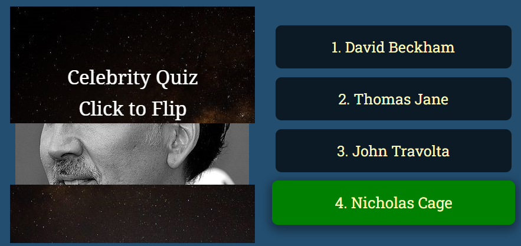
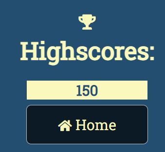
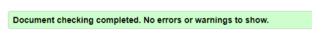
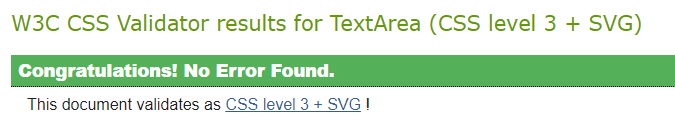
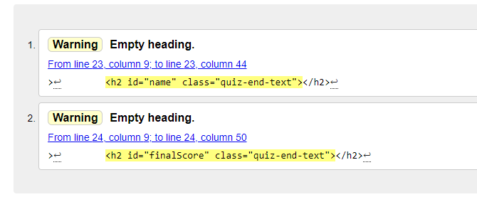
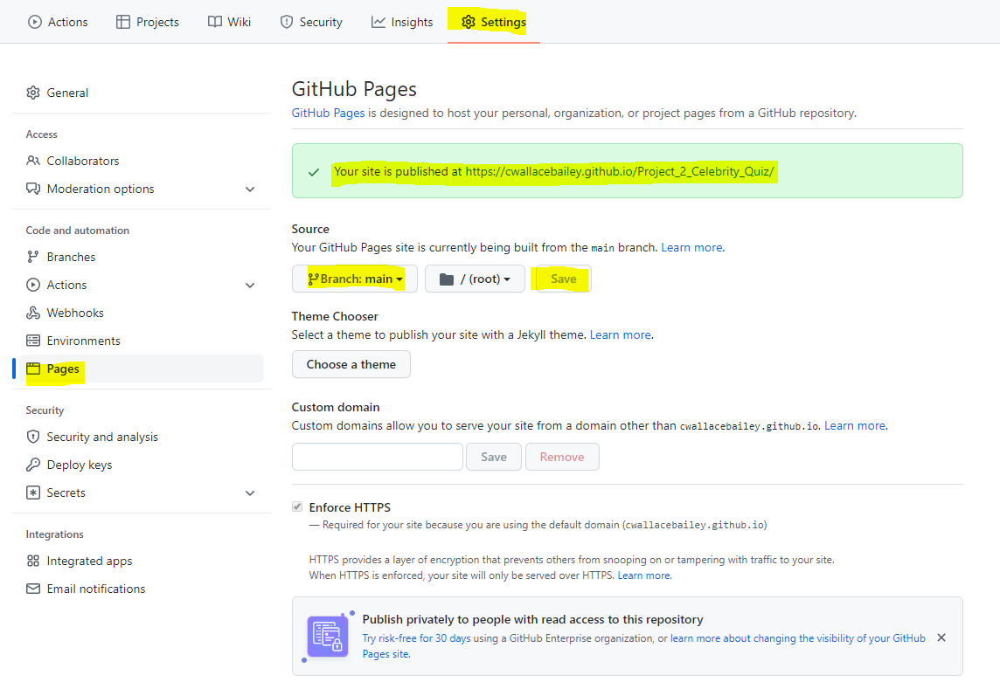
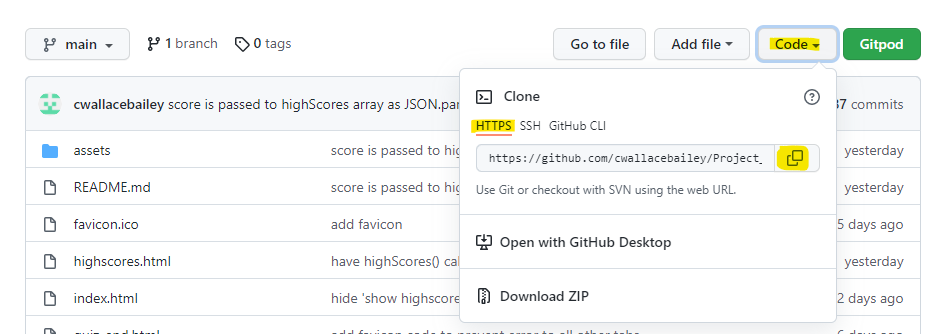

# Celebrity Quiz

The celebrity quiz is designed to be fully interactive, utilsing event listeners to create a image flip function which reveals a portion of a celebrity with each click. Each click then reduces the number of points which can be won in that particular round. the built in object, Math allows random question selection and order and sound effects are used to make the quiz engaging. It is designed to be responsive on multiple devices with a focus on simple, linear navigation. I chose this project mainly as a demonstration of the flexibility and range that Javascript allows. 

Please see the final project [here](https://cwallacebailey.github.io/Project_2_Celebrity_Quiz/).

## Contents

* [User Experience](#user-experience)
    * [Design](#design)
    * [Colours](#colours)
    * [Type Face](#type-face)
* [Features](#features)
    * [Existing Features](#existing-features)
        * [Home Page](#home-page)
        * [Quiz Page](#quiz-page)
        * [Quiz End Page](#quiz-end-page)
        * [Features to Implement](#features-left-to-implement)
* [Testing](#testing)
* [Deployment](#deployment)

# User Experience

The overall aim for this project was to build an interactive and engaging quiz which could be enjoyed by anyone with no overall target audience other than celebrity fans. This target demographic is wide reaching and diverse and the quiz is designed so that questions can easily be added to expand the quiz. This enables it to remain interesting to both new and return users.  

## Design
---
### Colours

The color scheme is uniform throughout the quiz using hex #234E70 for the blue background with hex #FBF8BE yellow/ cream for the font color. Finally a complimentary navy was chosen for the quiz buttons (hex #0c1a25)

The background colour does not distract from the main features of the quiz and the font colour is easily read as it nicely contrasts with the background. 

[return to contents](<#contents>)

### Type Face
Throughout the site Roboto Slab has been used. It's an easy to read, neat font which doesn't distract from the overall appearance of the site.

In case Roboto Slab isn't supported in the browser sans serif is available as a backup. As with Roboto this is an easy to read font which is widely accessible on browsers so should always be available making it an ideal backup font.    

[return to contents](<#contents>)

## Features
---
### Existing Features

#### Home Page

* Heading and Username
    * The opening page immediately welcomes the user and lets them know the premise of the site, a celebrity quiz. 
    * The site automatically focuses on the username text box preventing the user from having to click into the box. This makes the site easier to use and removes a potentially annoying step for the user. 

* If the user does not enter a username or their username is two characters or less when they click the "enter quiz button an alert will appear asking for a username over two characters
    

* The username is then stored locally to be displayed on the final page of the quiz, congratulating the user on finishing. This adds value as it adds a personal touch to the congratulations at the end of the quiz. A friendly vibe along with a fun quiz will invite further visits.

[return to contents](<#contents>)

* Button Hovering
    * When the cursor hovers over a button is increases in size by 3% and gains a slight shadow effect over 300 milliseconds. This adds value with an extra level of interactivity for the user. 

 

[return to contents](<#contents>)

* Instructions
    * The instructions button on the index page is easily visible and as a button the user should intuitively know to click the button to get access to the information
    * Once clicked the instructions button disapears and a box with informative guide as to how the quiz works is revealed. This box can be clicked for the instructions button to reappear. This keeps the index page neat and simple. 

  

[return to contents](<#contents>)

#### Quiz Page

* The top row of the quiz opening page keeps a uniform, clear title available for the user to see. This is followed by their current score, the points available to win in that round and the progress bar
    * The points to win reduces with each part of the celebrity image that is revealed. 40 is available with no clues, the user risks getting 0 if they guess at the stage. 20 points are available with a single section of the celebs face available to see, 10 points for two sections and so on.
    * The progress bar indicates how many questions are available before the end of the quiz by filling up with each question answered. 

* The central section of the quiz
    * Initially the user is presented with a selection of four answers and no celebrity image. The image quickly lets the user know what to do and looks nice on opening the quiz page. Once the user clicks an area of the image that portion of the celebrity image is revealed

The below shows before the user clicks

The below shows after a single click

The user is then able to either guess who the image is of or click another section of the image to reveal more of the celebrity. 

If they guess who is shown correctly the image flashes green and if the user has sound allowed they will hear applause, the points available will be added to the total score and a new question will be loaded. If incorrect the answer they selected will flash red and a sad horn noise will be heard if they have sound allowed, they will score 0 for that round. This adds value to the user with positive affirmation if they get the answer correct. The trumpet is slightly humerous if they get the wrong answer so they will not feel too bad about it. 

The celebrity images are pulled out of an array at random so the user cannot play through the quiz a second time and know the answers without clicking to reveal the celebrity image. In addition only 5 of a total of 10 questions are asked each time the user takes the quiz which means the user is unlikely to ever experience the same questions in the same order. 

* Bottom section of the quiz page. This section contains two features:
    * The first is the instuctions again if the user did not check on the first page or forgets how the game works. When clicked the text disapears and is replaced by a box with instructions in. If this box is clicked it disapears and is replaced with the original text.
    * The second feature allows the user to toggle sound effects on or off and adds value to the user if they want to listen to music or other sounds while playing the quiz without the quiz noises playing. 

The below shows the section when neither feature has been clicked

The below shows the section when both features have been clicked

[return to contents](<#contents>)

#### Quiz End Page

* Once the user has completed the quiz they are brought to the end of quiz page. Here the user is congratulated on finishing, their username is displayed along with their score and a comment under the score which is dependant on the score iteself. Over 100 it says "Wow, you really know your celebs", between 99 and 50 points it says "Not bad. You recognised someone..." ad under 50 it says "It's ok, celebs are not your thing". This adds value to the user with positive affirmation, using their name to make them feel welcome and then letting them know their score. 

From here the user can play again, go to the home page or check their highscores. 

#### Highscores Page

The highscores of the user are presented here, the below image shows only one as it has only been played through once. If played successive times more scores would appear up to a maximum of 5. Once the user has played through more than 5 times only the top 5 scores would be shown as the high scores array uses a splice to remove the lowest scores until only 5 high scores remain.

Highscores can only be seen once the quiz has been played through once and if user accesses this page before having played through the game the "play again" button is not visible. This prevents them being able to play the game without first inputting a username through the index.html page. 

[return to contents](<#contents>)

## Features left to Implement

Two key improvements

* It would be useful to add a feature which activates if the user tries to refresh their score while playing the quiz which alerts them that their score would be lost and allows them the opportunity to cancel the refresh. 

* It would be good to have a leaderboard rather than a highscores list allowing the user to see how they performed vs other users of the quiz. 

In addition to the above extra questions should be added to keep the quiz interesting and allow multiple play throughs without seeing the same celeb. Around 100 questions would probably offer a significantly improved user experience over the existing 25 questions. 

[return to contents](<#contents>)

# Testing

## Validation of Code

The Celebrity Quiz has been extensively tested. The code has been run through the [W3C html Validator](https://validator.w3.org/) and [W3C CSS validator](https://jigsaw.w3.org/css-validator/) with no errors. All pages returned the image below: 

The CSS code returned the response below: 

The exception is the quiz-end.html page which received two warnings for empty headings however, these are filled by the javascript running upon the page opening. If Javascript is not working the noscript would run telling the user this. As a result these warnings can be disregarded. 

[JS Validator](https://jshint.com/) was used to ensure there were no syntax errors or missing semi colons in the Javascript code. There were no erroris in the code but there were 43 warnings which all related to "let", 'const', template literals and arrow function syntax only being available in ES6 or "Functions declared within loops referencing an outer scoped variable may lead to confusing semantics. (randomNumber, pointsToWin, points)".

The metrics read that: 

There are 20 functions in this file.

Function with the largest signature take 2 arguments, while the median is 0.

Largest function has 22 statements in it, while the median is 5.5.

The most complex function has a cyclomatic complexity value of 9 while the median is 2.

[return to contents](<#contents>)

The below references "all features are functional". This accounts for the following: 

## Across all pages

* headings, buttons, images and fonts are responsive to screen size. 
* The favicon displays correctly 

## index.html

* Username field does not allow the user to access the quiz without entering a username over 2 characters with none of the characters being spaces. Once clicked with a username over 2 characters the user is taken to the quiz page (quiz-page.html) and the username is stored on local storage to be diplayed at the quiz-end page

* The highscores button takes you to the highscores page (highscores.html)

* Instructions button can be clicked to reveal instructions on how to play the game and once clicked the instructions button disapears. If these instructions are themselves clicked they disapear and the instructions button re-appears.

## Quiz Page

* The score correctly adds the points available to win each round
* The "points to win" reduces with each successive section of the celebrity image clicked excluding the first click which is free. This allows the user to score either 20, 10, 5 or 2 points. Points are not reduced if the same section of the image is clicked twice. 
* The progress bar fills up with each successive answer selected and after 5 questions are answered the bar appears full. On starting the quiz the bar appears empty. The progress bar disapears entiely on screen sizes with a width below 550 pixels 
* clicking each section of the "click to reveal" image reveals another section of the celebrity image to a maxmimum of four. The celebrity image is revealed in the correct order i.e. eyes do not appear below the nose or chin. 
* Hovering over the answers causes them to increase in size and produce a shadow. When selected if the answer if correct it appears green, if incorrect it appears red. If the sound is enabled a correct answer gives applause, if incorrect a sad horn noise is played. 
* "Click for Instructions" can be clicked to reveal instructions on how to play the game and once clicked the instructions button disapears. If these instructions are themselves clicked they disapear and the instructions button re-appears.
* On loading the image of a speaker shows that sound is muted and sound will not play regardless of the user getting a correct or incorrect answer. If clicked the image changes to a speaker producing sound and answers selected will produce one of two sounds mentioned above. 
* Once five answers have been given the user is taken to the quiz end page (quiz-end.html)

## Quiz End

* The users entered username is displayed and they are congratulated on finishing. The score is given and if they score more than 80 they see the message "Wow, you really know your celebs". If they score between 79 and 30 they see the message "Not bad. You recognised someone..." and anything below 30 "It's ok, celebs are not your thing"

* The home button takes the user to the home page
* play again takes the user to the quiz-page (quiz-page.html) and their username remains the same. 
* The highscores button takes the user to the highscores tab "highscores.html"

## Highscores tab

* The home button takes you to the home page (index.html)
* Highscores can be viewed at anypoint but if the user has not played through the quiz at least once the "play again" button is not visible. 
* Once clicked the "click to see" button on the highscores page disapears and if the user has played through the quiz at least once a scoreboard is produced. If the user has played through more than once the scores are in order of largest to smallest with largest being at the top. A maximum of 5 top scores can be shown. 

[return to contents](<#contents>)

## Browser Testing 

### Laptop Computer

* Chrome
    * Thoroughly tested and all features are functional

* Mozilla Firefox
    * Thoroughly tested and all features are functional

* Microsoft Edge
    * Thoroughly tested and all features are functional

* Internet Explorer
    * Internet explorer does not support the JS script and the click to enter button cannot be clicked so the quiz is unavailable on this browser. However, as this has been replaced with Microsoft Edge which does support all features of the quiz this should not be an issue. 

[return to contents](<#contents>)

### Mobile Phone

* Chrome
    * Thoroughly tested and all features are functional

* Mozilla Firefox
    * Thoroughly tested and all features are functional

The site responsiveness was tested and found to be suitable on the following devices: 

* Galaxy S5
* Pixel 2 XL
* Iphone 5 SE
* Iphone 6/7/8
* Iphone 6/7/8 Plus
* Iphone X
* iPad
* iPad Pro

[return to contents](<#contents>)

## Solved Bugs

# Deployment

## Steps for Deployment

The following steps can be followed to deploy this project on Github pages:
 
  1. In the GitHub repository, navigate to the Settings tab 
  2. From the source section drop-down menu, select the main Branch
  3. Once the main branch has been selected, the page will be automatically refreshed with a detailed ribbon display to indicate the successful deployment. 

[return to contents](<#contents>)

## Steps to Clone the Repository

To clone the repository in order to be able to make changes to the project without effecting the original repository please follow the steps below: 

1. Open Github and locate the repository you wish to copy
2. Above the list of files click "code"
3. To clone the repository using HTTPS, under "clone with HTTPS", click the copy icon. 
[return to contents](<#contents>)

4. Open Git Bash
5. Change the current working directory to the location where you want the cloned directory
6. Type git clone and then paste the URL you copied earlier
7. Press enter to create your local clonet